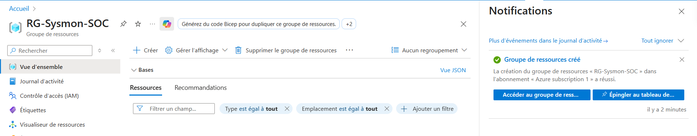
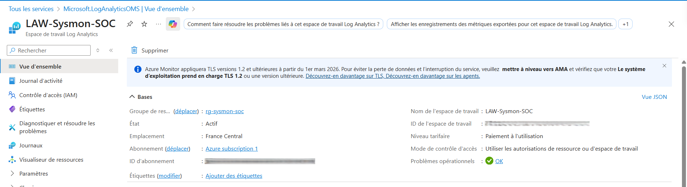
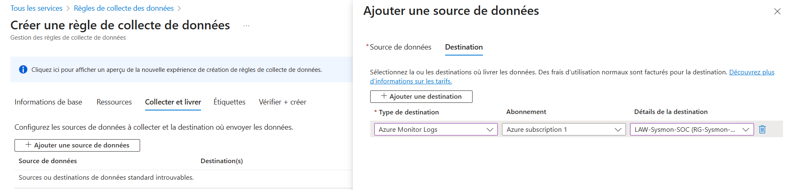
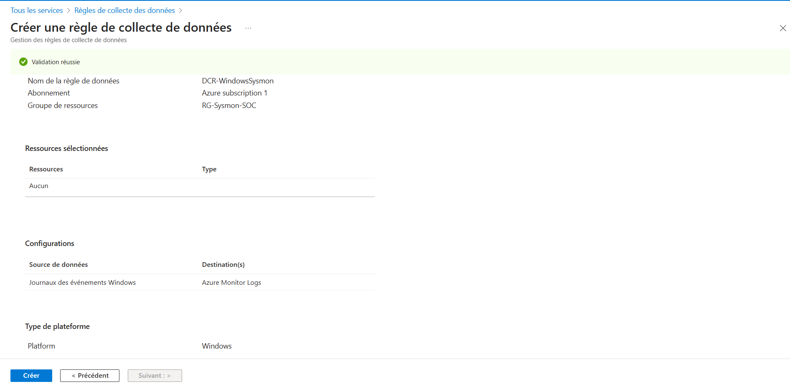
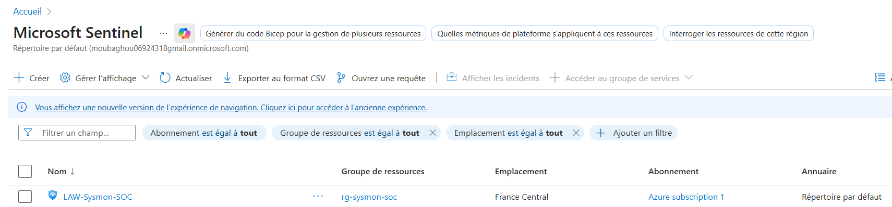

# Architecture – Sysmon SOC Windows

Ce dossier présente les éléments principaux de l’architecture Azure utilisés pour le pipeline de collecte et d’analyse des journaux : Resource Group, Log Analytics Workspace, Data Collection Rule et activation de Microsoft Sentinel.

## 1. Resource Group  
### `rg-created.png`  
  
**Description courte :** Création du groupe de ressources RG-Sysmon-SOC pour centraliser les services Azure du projet.

## 2. Log Analytics Workspace  
### `law-created.png`  
  
**Description courte :** Espace de travail Log Analytics utilisé pour stocker et interroger les logs collectés.

## 3. Data Collection Rule – Configuration  
### `dcr-config.png`  
  
**Description courte :** Configuration de la règle de collecte assignée à la plateforme Windows.

## 4. Data Collection Rule – Création  
### `dcr-created.png`  
  
**Description courte :** Validation de la règle DCR-WindowsSysmon et association à la destination LAW-Sysmon-SOC.

## 5. Activation de Microsoft Sentinel  
### `sentinel-enabled.png`  
  
**Description courte :** Activation de Microsoft Sentinel sur le workspace pour permettre l’analyse, la détection et l’investigation.

## Conclusion

Cette architecture met en place l’infrastructure nécessaire pour un pipeline complet : collecte, centralisation et analyse des événements Windows à travers Sysmon, LAW et Microsoft Sentinel.
