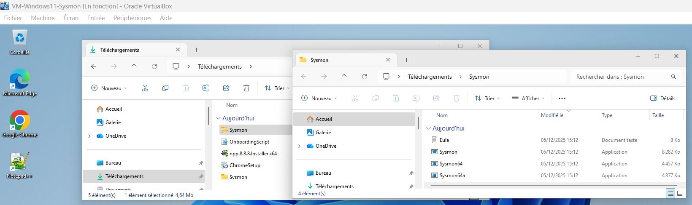
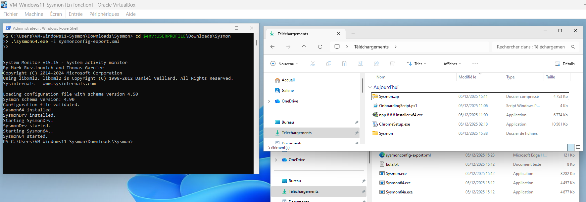
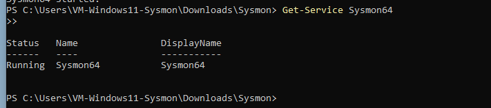
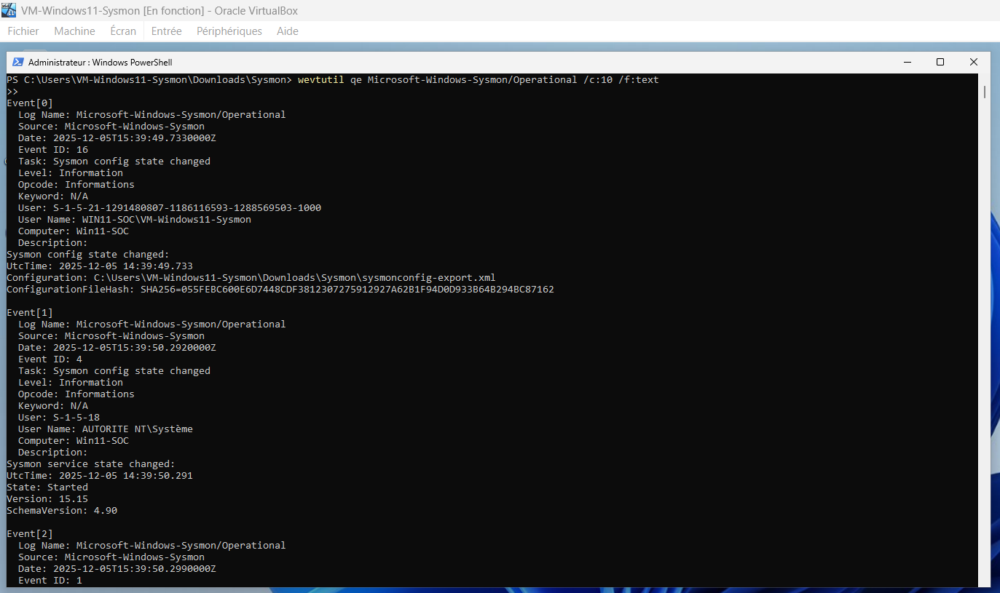
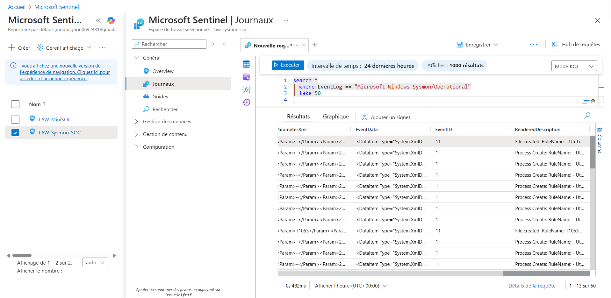

# Sysmon – Installation, Configuration et Vérification

Ce document décrit les étapes complètes d’installation de Sysmon sur la VM Windows, l’application de la configuration XML, et la validation du bon fonctionnement du service et des journaux dans Log Analytics et Microsoft Sentinel.

## 1. Extraction des fichiers Sysmon

Description : Extraction du dossier Sysmon contenant Sysmon.exe, Sysmon64.exe, Sysmon64a.exe et le fichier sysmonconfig-export.xml.

## 2. Installation de Sysmon avec la configuration
Commande utilisée :

```
cd $env:USERPROFILE\Downloads\Sysmon
.\sysmon64.exe -i sysmonconfig-export.xml
```


Description : Installation réussie de Sysmon v15.15 et chargement de la configuration XML.

## 3. Vérification du service Sysmon
Commande :

```
Get-Service Sysmon64
```


Description : Le service Sysmon64 est en cours d’exécution.

## 4. Vérification des événements Sysmon localement
Commande :

```
wevtutil qe Microsoft-Windows-Sysmon/Operational /c:10 /f:text
```


Description : Affichage des derniers événements Sysmon (Event ID 1, 4, 16…) directement depuis Windows.

## 5. Vérification des logs Sysmon dans Azure Log Analytics

Requête :

```
Event
| where EventLog == "Microsoft-Windows-Sysmon/Operational"
| take 50
```


Description : Ingestion réussie des logs Sysmon dans Log Analytics Workspace.

## 6. Vérification dans Microsoft Sentinel

Requête :

```
search *
| where EventLog == "Microsoft-Windows-Sysmon/Operational"
| take 50
```


Description : Microsoft Sentinel reçoit et interprète correctement les logs Sysmon.

## Conclusion
Sysmon est maintenant pleinement opérationnel dans ton Mini-SOC :
- Service installé et actif
- Configuration XML appliquée
- Événements visibles localement
- Logs ingérés dans Log Analytics
- Logs accessibles depuis Microsoft Sentinel

Fin du document.